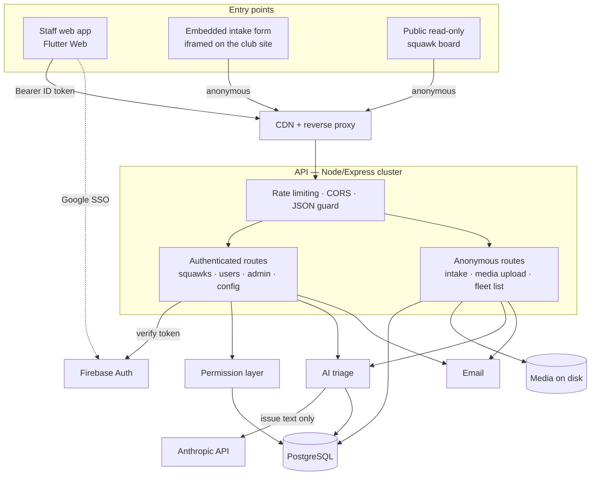
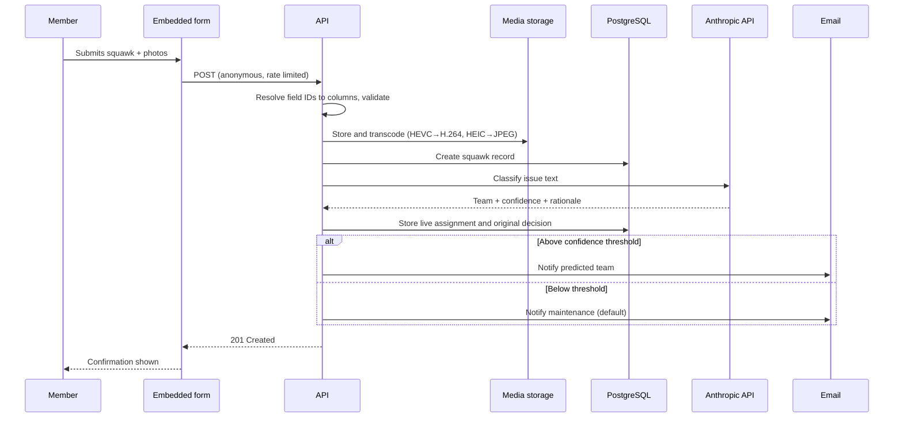

# scfc-stars-case-study
A case study of the STARS system at San Carlos Flight Center, designed for aircraft squawk submission and tracking for SCFC maintenance team. 

Source is not included — it's SCFC property. This README and the screenshots are the case study.

## What is it?

STARS is a production maintenance-tracking software I built for the Maintenance team at San Carlos Flight Center, serving the eight-person maintenance team, our admin team, and processing 60+ squawks per month. It has been in production for about ten months and tracks a fleet of about 25 planes. After I had been working at SCFC for about a year and a half under the Flight Line team, I approached my boss and asked if there were any contributions I could make that would allow me to build my tech expertise. My boss ended up recommending a centralized place where our maintenance team could track and resolve squawks. Prior to the implementation of STARS, all squawks were submitted to the maintenance email and were handled purely through the Gmail inbox. Nothing could answer 'what's still open on this aircraft' without someone searching a mailbox, and a recurring fault on the same plane looked like a new one every time.

## How does it work?

The full life cycle of a squawk is submission -> triage -> tracking -> resolution -> history:
- Intake — Most squawks come in through an embedded form on the SCFC website; staff can also create them directly
- Triage — The squawk is first passed through a prompted AI classifier to identify and assign to the resolution team and send a notification to the proper email to cut down response times
- Tracking — Once in the system, a member with proper authorization will be allowed to edit the status of a squawk as well as make company-wide notes, view photos (if submitted by the member), and merge with identical squawks
- Resolution — When a squawk is marked as resolved, the mechanic can add any additional notes attached to the plane and send an email to the member through the website itself
- Search and history — Tail number search across the full maintenance history of each aircraft as well as ability to archive squawks

## The stack

Frontend — Flutter Web (Dart), provider for state across eleven scoped containers, Firebase Auth for Google SSO with per-request ID tokens, plain http for the REST client including multipart upload streaming.

I chose Flutter Web for one codebase that renders correctly on a phone and a desktop without maintaining two clients. The cost is a heavier initial bundle than a comparable React app, but the tradeoff is worth it in our use case.

Backend — Node.js with Express and TypeScript, Prisma over PostgreSQL, Firebase Admin for token verification, Zod on every write route, Anthropic's API for squawk triage, Nodemailer for notifications, Multer for uploads, ffmpeg and heif-convert for media conversion.

Infrastructure — Reverse-proxied Node cluster behind a CDN, one worker per core. PostgreSQL on the same host. Uploaded media on local disk. Rate limiting is Postgres-backed rather than in-memory, because cluster workers don't share memory and in-memory counters would multiply every limit by the worker count.

Sign-in is restricted to club Google accounts, enforced server-side.

## Architecture

The intake and triage path in sequence:

## Design decisions

Two decisions where there was more than one reasonable option. For each: the constraint, what I built, and what it costs.

### 1. The AI routes every squawk, but only notifies when it's confident

The constraint — A cleaning item being routed to maintenance is a minor inconvenience, but an airworthiness-critical squawk being routed to flight line could lead to a serious problem. The cost of being wrong depends on which way you're wrong, and it's best not to have a critical maintenance squawk sitting unread in the flight line inbox if the model was unsure.

The alternatives — Notify whichever team the model picks and accept the error rate. Discard low-confidence classifications. Hold uncertain squawks in a human triage queue.

What I built — Two decoupled behaviors. The model's pick is stored unconditionally as the live team assignment, so the UI always shows a team. The email is gated: above a confidence threshold it notifies the predicted team, and below it, it falls back to maintenance — the team that can triage anything and the correct default when the model isn't sure. Manual reassignment bypasses the gate and always notifies the new team.

Separately, the model's original decision, confidence, and rationale are written to columns that are never overwritten, alongside the live assignment columns a human can change. That means the question "what did the model say, and did a human disagree?" is always answerable, which is the only reason routing accuracy is measurable at all.

What it costs — A below-threshold squawk shows a team in the UI that nobody on that team was emailed about — a real UI-versus-email inconsistency that's easy to misread. The threshold is a hardcoded constant with no feedback loop telling me whether it's the right number. And if the API is unavailable, the squawk is created unrouted.

How I know it works — I keep a test set with deliberate guard cases. A fuel system fault has to stay with maintenance even after I broadened the flight line taxonomy to cover fuel testers — and I run it repeatedly to check the classifier isn't unstable near category boundaries. In one real case an ambiguous squawk landed below threshold and correctly went to maintenance rather than the predicted team, which is the fallback behaving exactly as designed. I edit the taxonomy as needed.

### 2. Configurable intake forms, and the silent data loss I found before switching them on

The constraint — Admins needed to be able to relabel, reorder, and restructure the squawk intake form without a deploy in a way that was easy to understand. But submissions have to land in fixed database columns, and the existing hardcoded form had to keep working through the transition.

The alternatives — Force each field's ID to equal its destination column, which breaks the moment a field is deleted and recreated since IDs are generated. Store submissions as a JSON document, losing typed columns and every downstream query.

What I built — Each configured field carries an optional mappedTo naming its destination column. On submission the server rewrites keys from field ID to column name before validation, falling back to the field's own ID when no mapping is set. Validation then drops anything that doesn't match a known column.

What it cost — The actual story. That last step failed silently. The validator discarded unrecognized keys, returned a success response, and stored nothing. A field with a missing or wrong mapping would lose the member's data with no error, no log, and a confirmation message to the person who submitted it.

That bug was live for months. It never lost real data only because production was still serving the old hardcoded form — the dynamic path wasn't the one members were hitting yet. Switching over without checking would have silently dropped every field of every submission.

I found it during an audit before the switchover: baseline the existing config, patch every mapping with a dry-runnable script, then verify with a real end-to-end submission checking each column individually before making the dynamic form live. Then I added guards to the save endpoint so a config can't be saved that leaves a required column uncovered — using the same mapping-or-ID resolution the runtime uses, so the check can't drift from the behavior it protects.

The lesson I'd generalize: strip-unknown-keys-by-default is a dangerous validation technique for anything config-driven. Rejecting or at minimum logging unknown keys would have surfaced this the day it appeared instead of months later.

## What I'd do differently

Automated testing is close to absent where it matters. The backend has one test file covering authenticated CRUD paths against fully mocked database and auth layers, so no real query shapes or transactions are ever exercised. Every deploy is verified by manual smoke test, and the riskiest code in the system — the config round trip, the deep-link flow, the routing persistence path — has no automated verification at all. The classifier's test set is a hand-rolled script that costs real API calls and isn't wired into anything.

Silent failure as a default was the architectural mistake. Discarding unrecognized submission keys with a success response is the root of the data-loss class of bug above, and the guards I added afterward are compensating controls for a design that fails quietly. I'd invert the default.

References by string. Aircraft join to squawks by tail number with no foreign key, so renaming a tail number orphans its history. The per-squawk history is an append-only array of formatted strings — unqueryable, unbounded, timestamped by client clocks, and parsed back with a regex for display. It should be rows.

Two files got too big. The API client is around 2,000 lines of static methods; the config editor is around 1,900 holding model, drag-and-drop, validation, and preview. The static API client is why nothing downstream can be unit tested without crossing a static boundary — visible in the test suite, where the "API tests" only exercise an exception type.

The classification is awaited before the response returns, so a member submitting the form waits on the model — a deliberate tradeoff, because the routing has to be on the record before the email layer picks a recipient. Moving classification off the request path is the obvious next change.

## Why build instead of buy?

Off-the-shelf maintenance tracking exists, and for a larger operation it would probably be the right call. Two things pushed the other way here. The first is fit: SCFC's squawk workflow runs through the club website and the maintenance inbox, so the value was in having the intake form live on our own site and notifications land where the team already looks with a central website for tracking. A general-purpose product would have meant adapting the operation to the software rather than the reverse. The second is cost — recurring per-seat licensing is a real line item for a club this size, and I was already on staff. Building it also meant the system could keep changing as the maintenance team's process changed, which it has, repeatedly.

## What has it actually contributed?

STARS' contribution has been to response time and visibility rather than to catching missed squawks. Our maintenance team was already good at that. What it added is one place where the status of every aircraft is visible, and where all past issues on a given tail number come up in seconds instead of a mailbox search.

The clearest signal that it's relied on isn't a compliment — it's that people ask it for more. Shortly after routing went live, the head of maintenance came to me wanting to filter and sort by team, to assign squawks to a team rather than only to a person, and to be able to review and override what the classifier had decided. Those are requests from someone working in the system daily. The last one in particular told me the routing was being read critically rather than trusted blindly, which is exactly what the audit columns were built for.

## Current work

Most of what I build now is aimed at the system outliving my time at SCFC, and that's changed how I write things. The form editor ships with operator documentation covering what each column mapping does, which rules the server enforces, and what to verify after a change — because someone using it two years from now won't know that clearing one field silently stops submissions from saving.

The rules themselves live in the schema rather than the interface, so a config that would break the public intake form can't be saved at all. A reset-to-defaults behind a typed confirmation, plus a one-click config export, gives someone a way back if they get stuck anyway.

Of the gaps above, the two I'm actually working on are moving classification off the request path and getting automated coverage on the config round-trip — the piece with the most to lose and the least verification.

_Built and maintained by Matthew Moyer — Software Engineer and Lead Line Service Technician at San Carlos Flight Center._
